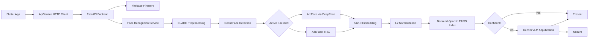
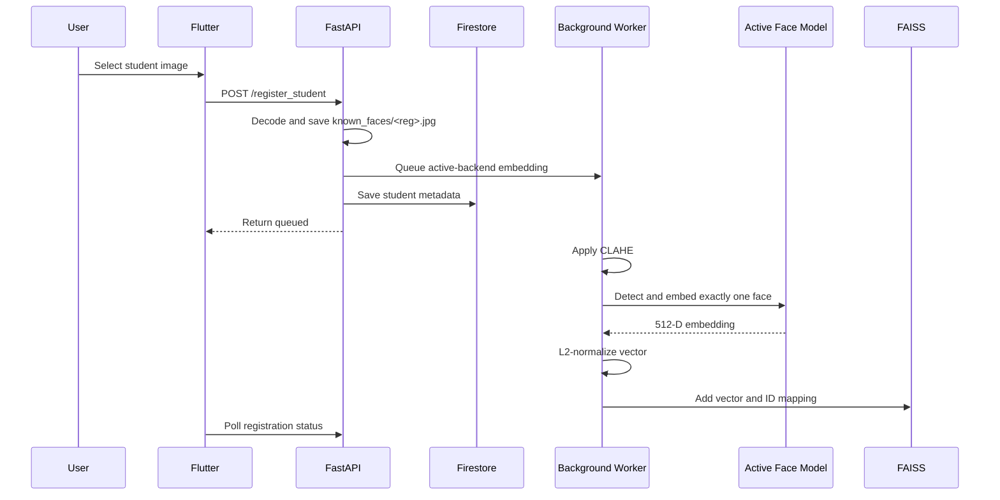
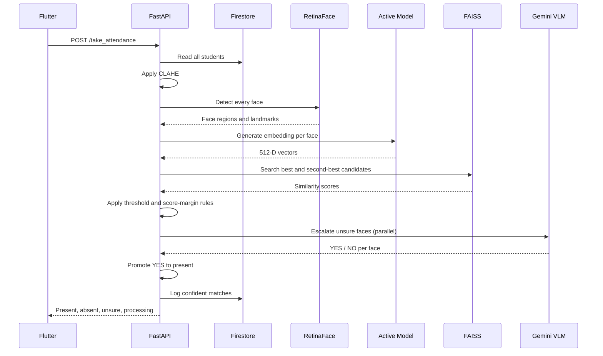
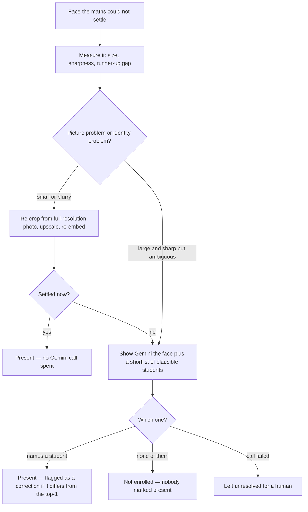

# Smart AI Attendance System — Architecture and System Design

The project is a Flutter client connected to a Python FastAPI backend. The backend communicates with Firebase Firestore for student metadata and attendance records, while face detection and recognition run locally using RetinaFace plus a selectable ArcFace or AdaFace backend. Faces the local model is not confident about are escalated to a Google Gemini vision model for a second opinion (see [VLM adjudication tier](#vlm-adjudication-tier)).

The important operational rule is:

> Only one recognition backend is active per backend process. ArcFace and AdaFace have separate indexes and cannot reuse each other’s embeddings.

Both indexes can exist on disk at the same time, but changing `FACE_RECOGNITION_BACKEND` requires stopping and restarting the API.

---

## Main architecture



## Frontend

The Flutter client contains the home, registration, student-management, camera/gallery attendance, and result screens. `ApiService` sends multipart HTTP requests to FastAPI and supports a compile-time URL, a saved URL from settings, and platform defaults.

The management screen reads students from Firestore and separately displays whether each student exists in the ArcFace and AdaFace indexes.

## FastAPI backend

The backend starts in `backend/main.py`. During startup it loads `.env`, validates the Firebase credential path, initializes Firestore, selects the backend using `FACE_RECOGNITION_BACKEND`, creates the selected face service, and mounts `/faces` for saved registration images.

Only one recognition backend is active inside one API process.

## Firebase

Firestore stores:

```text
students/<registration_number>
  name
  reg_number
  face_id

attendance_logs/<YYYY-MM-DD>
  date
  timestamp
  present_students[]
```

Firebase stores metadata and attendance records. Face embeddings are stored locally in FAISS, not in Firestore.

## Recognition backends

### ArcFace

ArcFace is provided by DeepFace. DeepFace uses RetinaFace for detection/alignment and ArcFace for the 512-dimensional embedding.

### AdaFace

AdaFace uses RetinaFace for detection, corrected five-landmark alignment, the AdaFace IR-50 PyTorch model, 112×112 BGR input normalized to `[-1, 1]`, and a 512-dimensional embedding.

The two models generate separate embeddings and therefore require separate FAISS indexes:

```text
known_faces/
├── <reg_number>.jpg
├── arcface/
│   ├── faiss.index
│   └── id_map.json
└── adaface/
    ├── faiss.index
    └── id_map.json
```

The raw registration image is shared, but the embeddings are backend-specific.

## Student registration flow



Registration is asynchronous. The API returns `queued` before embedding extraction finishes.

The worker saves the image, applies CLAHE, detects faces, requires exactly one face, extracts the active backend embedding, normalizes it, and stores it in the active FAISS index.

A registration affects only the active backend. If AdaFace is active, AdaFace is updated but ArcFace is not. The other backend must be synchronized or rebuilt separately. Re-registering a number replaces the active backend’s vector after successful processing, while the inactive backend may retain its older vector.

If extraction fails, the Firestore student record may already exist because Firestore is updated while embedding extraction runs in the background. The processing status must therefore be checked before attendance.

## Attendance flow



Where `V` is the Gemini VLM described below.

Each detected face is embedded, L2-normalized, and compared with FAISS using inner product, which is cosine similarity for normalized vectors.

A face is marked present only when:

```text
best_score >= DEEPFACE_MATCH_THRESHOLD
and
best_score - second_best_score >= FACE_MATCH_MARGIN
```

A weaker or ambiguous result becomes `unsure`. Low scores are skipped. Stale FAISS identities that no longer exist in Firestore are ignored and cannot be logged as attendance.

## VLM adjudication tier

Face embeddings are good at clear, front-facing, well-lit faces. They get weak exactly where a classroom group photo is hardest: small faces at the back, motion blur, side angles, partial occlusion. Those faces land in the `unsure` band — recognisable to a human, not to the maths.

The VLM tier gives those faces a second opinion. `services/vlm_service.py` sends two JPEGs to a Google Gemini vision model — the student's stored registration photo and the crop taken from the group photo — and asks whether they are the same person.

### Where it sits in the pipeline

It runs **after** the three-tier classification, inside `BaseFaceService.take_attendance()`, and it only ever touches the `unsure` bucket:

```text
best_score >= match_threshold AND margin >= match_margin   →  present   (VLM not called)
best_score >= unsure_threshold                             →  unsure    →  VLM adjudicates
best_score <  unsure_threshold                             →  skipped   (VLM not called)
```

A `YES` promotes the face from `unsure` to `present` and sets `vlm_verified: true` on the student entry, which the Flutter result screen renders as a blue verified badge. A `NO` leaves it `unsure`. The VLM can only **promote**; it never demotes a confident local match, so a Gemini outage degrades the system to plain FAISS behaviour rather than breaking it.

Escalations run in parallel across a `ThreadPoolExecutor` (5 workers), because each call is slow.

### Transport

`services/vlm_service.py` reaches Gemini two ways and prefers the first:

| Transport | When | Why it matters |
|---|---|---|
| **Vertex AI** | `VERTEX_PROJECT` is set (GCP project `smart-attendance-37133`, ADC auth) | Real quota. `gemini-3.7-flash` answers in ~3.5 s. |
| AI Studio API key | fallback, `GEMINI_API_KEY` | Free tier. Measured returning `503 high demand` for minutes at a time, failing every scan. |

It also keeps a **model chain**: a preferred model followed by lighter stand-ins (`gemini-3.5-flash`, `gemini-3.1-flash-lite`). A model that fails is marked unhealthy and skipped for a cooldown, so one bad model does not burn the timeout on every face of a scan.

```dotenv
VERTEX_PROJECT=smart-attendance-37133
VERTEX_LOCATION=global
VLM_MODEL_NAME=gemini-3.7-flash
VLM_FALLBACK_MODELS=gemini-3.5-flash,gemini-3.1-flash-lite
```

Measured on Vertex, 2026-08-26: `gemini-3.7-flash` 3.5 s, `gemini-3.5-flash` 1.7 s, `gemini-3.1-flash-lite` 0.9 s. Model IDs are the same strings on both transports; `gemini-2.0-flash` and `gemini-3-flash` do not exist on Vertex.

---

## The Adjudicator

The VLM tier above answers a closed question — "is this person X?" — about faces that were already nearly right. The Adjudicator (`services/adjudicator.py`) replaces that with an investigation, and is what the system is actually built around now.

### Why the pipeline needed one

The pipeline always runs the same steps in the same order and answers every face with a number. That is fine when the number is decisive and useless when it is not, which is exactly what classroom photos keep producing: a face turned away, a student at the back forty pixels wide, two siblings in one class.

### The loop

Faces are investigated in parallel; tools within a single face run in sequence, because each choice depends on what the last one found.



### Rules that must not be broken

- **Everything is keyed by `face_id`, never by student.** Two faces in one photo can produce the same top-1 guess, and identity-keyed state merges them into one.
- **"None of these" is a verdict, not an error.** An open room contains people who are not on the roster. A system that cannot say so will assign a stranger to whoever scored highest.
- **An `error` is never a rejection.** A failed check leaves the face unresolved.
- **The shortlist is trimmed.** Neighbours scoring far below the leader are noise: they slow a multi-image request down and add ways to name the wrong person.
- **The loop is bounded** by `ADJ_MAX_INVESTIGATIONS` and `ADJ_TIME_BUDGET_SECONDS`, best-scoring faces first.

### The reasoning trace

Every observation, decision and outcome is emitted as it happens, with a thumbnail of the face under discussion, and accumulated by `services/job_store.py`.

```text
POST /take_attendance_agentic   -> { job_id }        returns in milliseconds
GET  /attendance_job/{id}?since=N -> events since N, plus the result when done
```

Because the upload does not wait for the scan, a slow investigation can no longer trip the client's request timeout — the entire failure class the old synchronous route suffered from is structurally gone. The cursor makes reconnecting free, and means each thumbnail is downloaded exactly once.

`POST /take_attendance` is unchanged and still works, as a fallback.

### Known limits

1. **The shortlist comes from vector neighbours.** If an embedding is bad enough that the true student never ranks, Gemini is never shown them, and the face can be reported "not enrolled". This is the honest limit of the current design.
2. **Only one embedding backend is consulted.** Trying the other one was deliberately not built: only one loads per process, and combining PyTorch and TensorFlow is what `KMP_DUPLICATE_LIB_OK` already papers over.
3. **Jobs live in process memory.** Restarting the API loses in-flight traces. The attendance record itself goes to Firestore and is unaffected.

## Synchronization and rebuild behavior

Normal synchronization reads Firebase students and adds only IDs missing from the selected backend index. It does not refresh existing embeddings.

The local rebuild command reads registration images directly, clears the selected backend index, re-embeds all local images, and removes orphaned index-only identities. It does not contact Firebase. The API must be stopped during a rebuild.

Both backends can be rebuilt independently by changing `FACE_RECOGNITION_BACKEND` and rebuilding again.

## Runtime behavior and reliability

Normal registration and attendance are straightforward once the selected backend index is prepared, but the system is not fully automatic across both models. Only one backend processes a new registration at a time, a second backend requires a separate sync/rebuild, and registration images must contain exactly one detectable face.

Deleted students can remain physically present in the inactive index until it is rebuilt. Indexes must be rebuilt after model, alignment, or preprocessing changes. AdaFace runs on CPU in this environment, so battery mode can make inference slower.

`/take_attendance` used to call the CPU-heavy pipeline directly inside an async FastAPI route, so a long scan blocked `/students`, health checks and every other request until it finished. It now runs under `asyncio.to_thread`, as does the blocking Firestore read that precedes it. Verified live: the API stays responsive throughout a scan, including while a Gemini call is in flight.

The adjudicated route goes further and does not hold a request open at all — it returns a job id and the client polls. Combined with per-call model timeouts, a background warm-up at startup, and Vertex's ~3.5 s latency, the "scan exceeds the client timeout" failure mode is gone rather than merely mitigated.

The corrected AdaFace pipeline and local rebuild improved stored-vector separation. The local AdaFace index currently contains 11 valid identities; one source image was rejected because it contained two faces and needs a clean replacement.

### Known Issues & Workarounds

*   **OpenMP Conflict (Windows)**: Running PyTorch (AdaFace) and TensorFlow (RetinaFace/ArcFace) in the same process causes an OpenMP conflict (`libiomp5md.dll`) which will silently crash the Python server. This is bypassed by setting `os.environ["KMP_DUPLICATE_LIB_OK"] = "TRUE"` at the top of `main.py`.